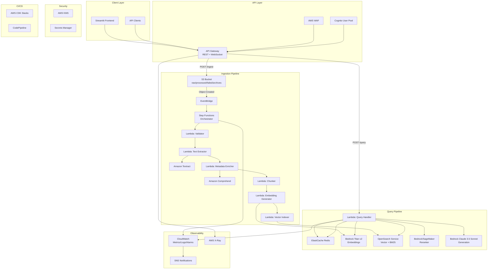
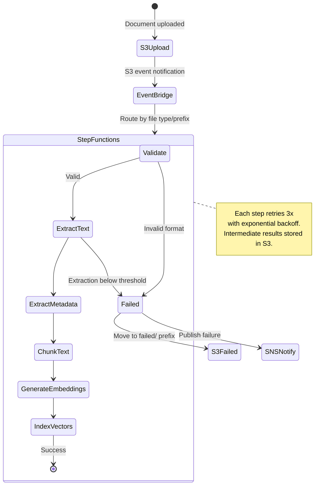
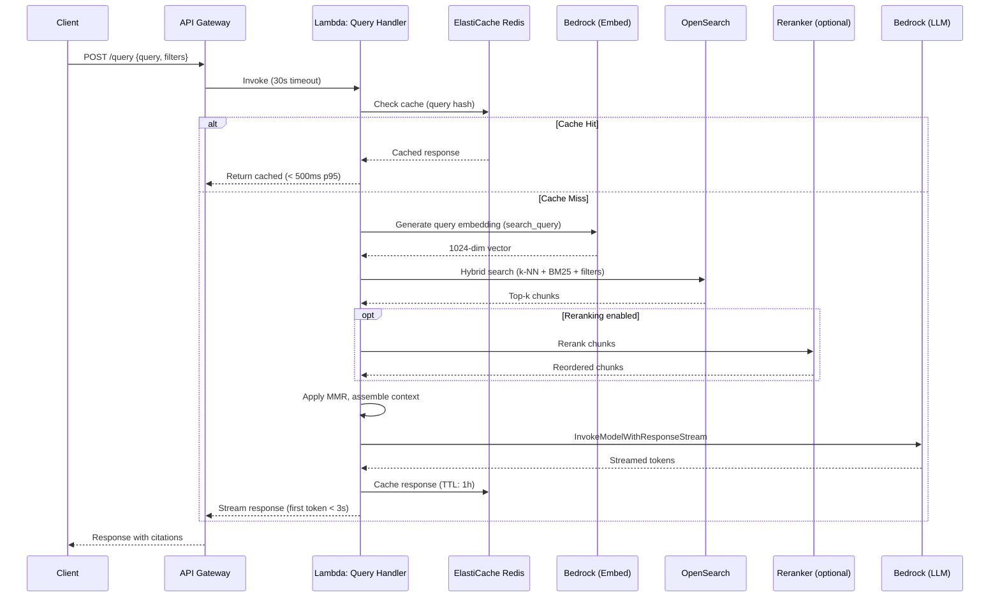
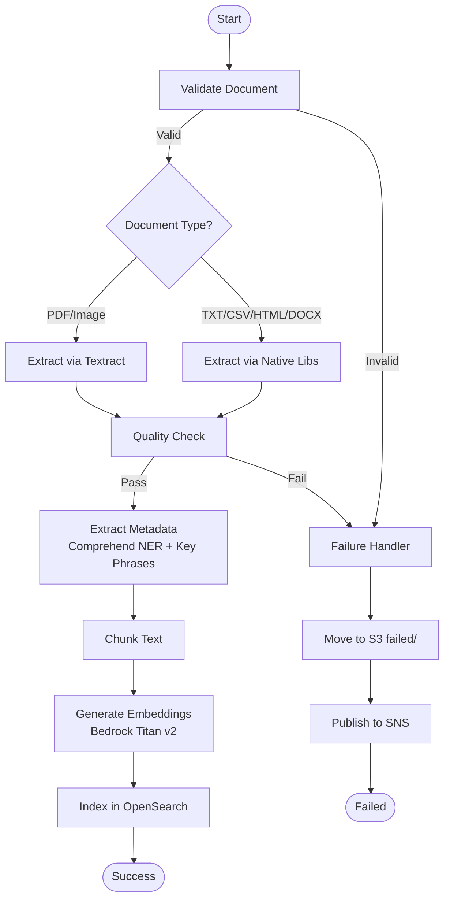
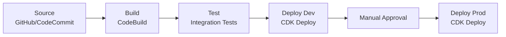

# Design Document: AWS-Native RAG Service

## Overview

This design describes a production-grade, fully AWS-native Retrieval Augmented Generation (RAG) service. The system is composed of two primary pipelines:

1. **Ingestion Pipeline (offline)**: Receives documents via S3, triggers event-driven processing through Step Functions, extracts text (Textract/native libs), enriches metadata (Comprehend), chunks text, generates embeddings (Bedrock Titan v2), and indexes vectors in OpenSearch.
2. **Query Pipeline (real-time)**: Receives user queries via API Gateway, checks Redis cache, generates query embeddings, performs hybrid search (vector + BM25) in OpenSearch, optionally reranks results, assembles context, invokes Bedrock Claude 3.5 Sonnet for generation, caches the response, and streams the answer back.

Supporting layers include: ElastiCache Redis for multi-tier caching, Cognito for authentication, CloudWatch/X-Ray for observability, AWS CDK for IaC, and a RAGAS evaluation pipeline for quality measurement.

All components are AWS-managed services. No third-party or self-hosted infrastructure is used.

### Key Design Decisions

| Decision | Choice | Rationale |
|----------|--------|-----------|
| Vector DB | OpenSearch Service | Native hybrid search (vector + BM25), metadata filtering, mature k-NN plugin. Aurora pgvector is a cost alternative for <1M vectors. |
| Embedding Model | Bedrock Titan v2 (1024d) | AWS-native, configurable dimensions, 8192 token input, lowest cost at ~$0.0001/1K tokens |
| LLM | Bedrock Claude 3.5 Sonnet | Best quality/cost ratio, 200K context, streaming support. Haiku as cost fallback. |
| Orchestration | Step Functions | Native retry/catch, parallel/map states, visual debugging, integrates with all AWS services |
| Compute | Lambda (serverless) | Zero idle cost, auto-scaling, pay-per-invocation. App Runner as alternative for long-running containers. |
| Cache | ElastiCache Redis | Sub-millisecond latency, supports multiple cache tiers (embeddings, results, responses, sessions) |
| IaC | AWS CDK (Python) | Type-safe, composable stacks, native AWS construct library |
| Auth | Cognito + WAF | Managed user pools, JWT validation, DDoS protection |

---

## Architecture

### High-Level System Architecture



### Ingestion Pipeline Flow



### Query Pipeline Flow



---

## Components and Interfaces

### 1. Storage Layer (S3)

**Responsibility**: Document storage with encryption, versioning, and lifecycle management.

**S3 Bucket Structure**:
```
rag-documents-{account-id}-{region}/
├── raw/                    # Uploaded documents awaiting processing
├── processed/
│   ├── text/               # Extracted text output
│   ├── chunks/             # Chunked JSON output
│   └── metadata/           # Enriched metadata JSON
├── failed/                 # Documents that failed processing
└── archives/               # Archived documents (lifecycle-managed)
```

**Bucket Configuration**:
- Encryption: SSE-KMS with customer-managed key
- Versioning: Enabled on `raw/` prefix for audit trail
- Lifecycle policies:
  - `raw/` → S3 Intelligent-Tiering after 30 days → S3 Glacier after 90 days
  - `processed/` → S3 Intelligent-Tiering after 60 days
  - `failed/` → Expire after 180 days
- Event notifications: S3 → EventBridge for `ObjectCreated` events on `raw/` prefix
- CORS: Configured for Streamlit frontend uploads
- Supported file types: PDF, PNG, JPEG, TIFF, DOCX, TXT, CSV, HTML

**Interface**:
```python
class StorageService:
    def upload_document(self, file: bytes, filename: str, content_type: str) -> str:
        """Upload document to raw/ prefix. Returns S3 key."""

    def get_document(self, document_id: str) -> bytes:
        """Retrieve document by ID."""

    def move_to_failed(self, s3_key: str, error_reason: str) -> None:
        """Move document to failed/ prefix with error metadata."""

    def move_to_processed(self, s3_key: str) -> None:
        """Move document to processed/ prefix after successful ingestion."""

    def store_intermediate(self, document_id: str, stage: str, data: dict) -> str:
        """Store intermediate processing result (text, chunks, metadata)."""
```

### 2. Event-Driven Trigger (EventBridge)

**Responsibility**: Detect S3 uploads and route processing events to Step Functions.

**EventBridge Rule Pattern**:
```json
{
  "source": ["aws.s3"],
  "detail-type": ["Object Created"],
  "detail": {
    "bucket": { "name": ["rag-documents-{account-id}-{region}"] },
    "object": {
      "key": [{ "prefix": "raw/" }]
    }
  }
}
```

**Configuration**:
- Target: Step Functions state machine ARN
- Dead letter queue: SQS queue for failed event deliveries
- Input transformer: Extract bucket, key, file type from event detail
- Retry policy: 2 retries with exponential backoff on target delivery failure

**Interface**:
```python
class EventRouter:
    def route_event(self, event: S3Event) -> str:
        """Route S3 event to Step Functions. Returns execution ARN."""

    def validate_event(self, event: S3Event) -> bool:
        """Validate event matches supported file types and prefix."""
```

### 3. Processing Orchestrator (Step Functions)

**Responsibility**: Coordinate multi-step document processing with retry logic and error handling.

**State Machine Definition**:


**Step Configuration**:

| Step | Lambda Function | Memory | Timeout | Retries |
|------|----------------|--------|---------|---------|
| Validate | `rag-validator` | 512 MB | 30s | 3 (backoff: 2s, 4s, 8s) |
| Text Extract | `rag-text-extractor` | 1024 MB | 300s | 3 (backoff: 5s, 10s, 20s) |
| Metadata Extract | `rag-metadata-enricher` | 1024 MB | 120s | 3 (backoff: 2s, 4s, 8s) |
| Chunk Text | `rag-chunker` | 512 MB | 60s | 2 (backoff: 2s, 4s) |
| Generate Embeddings | `rag-embedding-generator` | 1024 MB | 300s | 5 (backoff: 2s, 4s, 8s, 16s, 32s) |
| Index Vectors | `rag-vector-indexer` | 512 MB | 120s | 3 (backoff: 2s, 4s, 8s) |

**Error Handling**:
- Each step has a `Catch` block routing to the failure handler
- Failure handler moves document to `failed/` prefix and publishes to SNS
- Intermediate results stored in S3 between steps for recovery
- Idempotency: document_id used as deduplication key; reprocessing overwrites existing index entries

### 4. Text Extraction (Lambda + Textract)

**Responsibility**: Extract text from documents using Textract for PDFs/images and native libraries for text formats.

**Extraction Strategy by Format**:

| Format | Method | API | Notes |
|--------|--------|-----|-------|
| PDF (text-based) | Textract | `DetectDocumentText` | Fast, accurate |
| PDF (scanned/image) | Textract OCR | `DetectDocumentText` | OCR-based |
| PDF (tables/forms) | Textract | `AnalyzeDocument` | Structured extraction |
| PDF (>15 pages) | Textract Async | `StartDocumentAnalysis` | Avoids Lambda timeout |
| PNG, JPEG, TIFF | Textract OCR | `DetectDocumentText` | Image-to-text |
| DOCX | python-docx | N/A | Native library |
| TXT | Built-in | N/A | Direct read |
| CSV | csv/pandas | N/A | Native library |
| HTML | BeautifulSoup | N/A | Strip tags, extract text |

**Interface**:
```python
class TextExtractor:
    def extract(self, s3_bucket: str, s3_key: str, content_type: str) -> ExtractionResult:
        """Extract text from document. Routes to Textract or native based on type."""

    def validate_quality(self, text: str, min_length: int = 50) -> bool:
        """Check extracted text meets minimum quality threshold."""

@dataclass
class ExtractionResult:
    document_id: str
    text: str
    pages: int
    tables: list[dict]       # Extracted tables (if any)
    forms: list[dict]        # Extracted form fields (if any)
    extraction_method: str   # "textract" | "native"
    confidence: float        # Textract confidence score (0-1)
```

### 5. Metadata Extraction (Lambda + Comprehend)

**Responsibility**: Enrich documents with NLP-derived metadata for filtering and search.

**Comprehend Operations**:
- `detect_entities()` → Named entities (PERSON, LOCATION, ORGANIZATION, DATE, etc.)
- `detect_key_phrases()` → Key phrases for topic identification
- `detect_dominant_language()` → Language code (en, es, fr, etc.)
- `detect_pii_entities()` → PII detection (optional, configurable)

**Interface**:
```python
class MetadataEnricher:
    def enrich(self, text: str, document_id: str, pii_detection: bool = False) -> DocumentMetadata:
        """Extract metadata from text using Comprehend."""

@dataclass
class DocumentMetadata:
    document_id: str
    entities: list[Entity]         # {text, type, score}
    key_phrases: list[str]
    language: str
    pii_detected: bool
    pii_entities: list[PIIEntity]  # {type, score, begin_offset, end_offset}
```

### 6. Chunking Engine (Lambda)

**Responsibility**: Split extracted text into optimally-sized chunks with metadata.

**Supported Strategies**:

| Strategy | Parameters | Best For |
|----------|-----------|----------|
| Fixed-size | chunk_size=1000 tokens, overlap=200 tokens | Uniform documents |
| Semantic | min=200, max=1500 tokens, boundary=headers/paragraphs | Structured docs |
| Recursive character | separators=["\n\n", "\n", ". ", " "] | Mixed content |
| Sentence window | window_size=3 sentences | Q&A, precise retrieval |

**Interface**:
```python
class ChunkingEngine:
    def chunk(self, text: str, strategy: str, config: ChunkConfig) -> list[Chunk]:
        """Split text into chunks using specified strategy."""

@dataclass
class ChunkConfig:
    strategy: str           # "fixed" | "semantic" | "recursive" | "sentence_window"
    chunk_size: int         # Target token count (default: 1000)
    overlap: int            # Overlap tokens (default: 200)
    min_chunk_size: int     # Minimum tokens (default: 200)
    max_chunk_size: int     # Maximum tokens (default: 1500)
    window_size: int        # Sentence window size (default: 3)

@dataclass
class Chunk:
    chunk_id: str           # "{document_id}_chunk_{index}"
    document_id: str
    chunk_index: int
    content: str
    chunk_size: int         # Token count
    start_position: int     # Character offset in original text
    end_position: int
    metadata: ChunkMetadata

@dataclass
class ChunkMetadata:
    section_title: str | None
    page_number: int | None
    entities: list[str]
    key_phrases: list[str]
```

### 7. Embedding Generator (Lambda + Bedrock)

**Responsibility**: Convert text chunks into 1024-dimensional vector embeddings using Bedrock Titan v2.

**Configuration**:
- Model ID: `amazon.titan-embed-text-v2:0`
- Dimensions: 1024 (configurable: 256, 512, 1024)
- Batch size: Up to 100 chunks per API call
- Input type: `search_document` for indexing, `search_query` for queries
- Normalization: Enabled (L2 normalization)
- Cache: Embeddings cached in Redis keyed by SHA-256 hash of chunk text, TTL 30 days

**Interface**:
```python
class EmbeddingGenerator:
    def generate_embeddings(self, chunks: list[Chunk], input_type: str = "search_document") -> list[EmbeddingResult]:
        """Generate embeddings for a batch of chunks. Checks cache first."""

    def generate_query_embedding(self, query: str) -> list[float]:
        """Generate a single embedding for a query string."""

@dataclass
class EmbeddingResult:
    chunk_id: str
    embedding: list[float]   # 1024-dimensional vector
    cached: bool             # Whether retrieved from cache
```

**Batching Strategy**:
1. Group chunks into batches of 100
2. Check Redis cache for each chunk (by text hash)
3. Generate embeddings only for cache misses
4. Store new embeddings in Redis cache
5. Retry on Bedrock throttling with exponential backoff (up to 5 retries)

### 8. Vector Store (OpenSearch Service)

**Responsibility**: Store and search vector embeddings with hybrid search (k-NN + BM25) and metadata filtering.

**Cluster Configuration (Production)**:
- 3 dedicated master nodes: `r6g.large.search`
- 3 data nodes: `r6g.xlarge.search`
- Multi-AZ deployment with zone awareness
- EBS storage: gp3, 500 GB per data node
- Encryption at rest: KMS customer-managed key
- Encryption in transit: TLS 1.2
- VPC deployment: Private subnets only

**Index Mapping**:
```json
{
  "mappings": {
    "properties": {
      "chunk_id": { "type": "keyword" },
      "document_id": { "type": "keyword" },
      "content": { "type": "text", "analyzer": "standard" },
      "embedding": {
        "type": "knn_vector",
        "dimension": 1024,
        "method": {
          "name": "hnsw",
          "space_type": "cosinesimil",
          "engine": "nmslib",
          "parameters": {
            "ef_construction": 512,
            "m": 16
          }
        }
      },
      "metadata": {
        "properties": {
          "document_id": { "type": "keyword" },
          "source": { "type": "keyword" },
          "timestamp": { "type": "date" },
          "category": { "type": "keyword" },
          "entities": { "type": "keyword" },
          "key_phrases": { "type": "keyword" },
          "section_title": { "type": "keyword" },
          "page_number": { "type": "integer" },
          "language": { "type": "keyword" }
        }
      }
    }
  },
  "settings": {
    "index": {
      "knn": true,
      "number_of_shards": 3,
      "number_of_replicas": 2,
      "refresh_interval": "1s"
    }
  }
}
```

**Interface**:
```python
class VectorStore:
    def index_chunks(self, chunks_with_embeddings: list[dict]) -> None:
        """Bulk index chunks with embeddings. Idempotent by chunk_id."""

    def hybrid_search(self, query_embedding: list[float], query_text: str,
                      k: int = 10, filters: dict = None) -> list[SearchResult]:
        """Hybrid search combining k-NN and BM25 with optional metadata filters."""

    def reindex(self, new_index_name: str) -> None:
        """Zero-downtime reindex using alias switching."""

@dataclass
class SearchResult:
    chunk_id: str
    document_id: str
    content: str
    score: float
    metadata: dict
```

**Hybrid Search Query**:
```json
{
  "size": 10,
  "query": {
    "hybrid": {
      "queries": [
        { "knn": { "embedding": { "vector": "[query_vector]", "k": 50 } } },
        { "match": { "content": "query text" } }
      ]
    }
  },
  "post_filter": {
    "bool": {
      "filter": [
        { "term": { "metadata.category": "technical" } },
        { "range": { "metadata.timestamp": { "gte": "2024-01-01" } } }
      ]
    }
  }
}
```

**Reindexing Strategy**:
1. Create new index with updated mapping (e.g., `rag-chunks-v2`)
2. Bulk reindex from old index to new index
3. Set refresh interval to 30s during bulk load
4. Atomic alias switch: `rag-chunks` alias → `rag-chunks-v2`
5. Delete old index after verification

### 9. Query Handler (Lambda)

**Responsibility**: Orchestrate the real-time query pipeline: cache check → embed → search → rerank → assemble → generate → cache → stream.

**Interface**:
```python
class QueryHandler:
    def handle_query(self, request: QueryRequest) -> QueryResponse:
        """Execute the full query pipeline."""

@dataclass
class QueryRequest:
    query: str
    filters: dict | None        # Metadata filters
    k: int = 10                  # Number of chunks to retrieve
    rerank: bool = False         # Enable reranking
    temperature: float = 0.7
    max_tokens: int = 4096
    stream: bool = True          # Enable streaming

@dataclass
class QueryResponse:
    answer: str
    sources: list[SourceCitation]
    query_embedding: list[float] | None
    cached: bool
    latency_ms: int

@dataclass
class SourceCitation:
    document_id: str
    chunk_id: str
    content_snippet: str
    score: float
    page_number: int | None
```

**Pipeline Steps**:
1. Hash query + filters → check Redis for cached response
2. On cache miss: generate query embedding via Bedrock Titan v2 (`search_query`)
3. Execute hybrid search in OpenSearch (k-NN + BM25 + metadata filters)
4. Optionally rerank results via Bedrock/SageMaker
5. Apply MMR (Maximal Marginal Relevance) for diversity, select top 5-10 chunks
6. Assemble context prompt with system instructions and retrieved chunks
7. Invoke Bedrock Claude 3.5 Sonnet via `InvokeModelWithResponseStream`
8. Cache full response in Redis (TTL: 1 hour)
9. Stream tokens back to client via WebSocket or chunked HTTP response

### 10. LLM Generator (Bedrock)

**Responsibility**: Generate natural language answers from retrieved context using Claude 3.5 Sonnet.

**Model Configuration**:
- Primary: `anthropic.claude-3-5-sonnet-20241022-v2:0`
- Fallback: `anthropic.claude-3-5-haiku-20241022-v1:0`
- Temperature: 0.7 (configurable)
- Top-p: 0.9 (configurable)
- Max tokens: 4096 (configurable)
- Streaming: `InvokeModelWithResponseStream`
- Guardrails: Bedrock Guardrails for content safety (configurable)

**System Prompt Template**:
```
You are a helpful AI assistant. Answer questions based ONLY on the provided context.

Guidelines:
- If the context doesn't contain the answer, say "I don't have enough information to answer this question."
- Cite sources by referencing the document name and section.
- Be concise and accurate.
- Do not fabricate information.
```

**RAG Prompt Template**:
```
Context:
{retrieved_chunks_with_metadata}

Question: {user_query}

Instructions:
- Answer based only on the context above.
- Cite the relevant document sections using [Source: document_name, page X].
- If uncertain, acknowledge limitations.

Answer:
```

**Interface**:
```python
class LLMGenerator:
    def generate(self, context: str, query: str, config: GenerationConfig) -> str:
        """Generate answer from context. Non-streaming."""

    def generate_stream(self, context: str, query: str, config: GenerationConfig):
        """Generate answer with streaming. Yields token chunks."""

@dataclass
class GenerationConfig:
    model_id: str = "anthropic.claude-3-5-sonnet-20241022-v2:0"
    temperature: float = 0.7
    top_p: float = 0.9
    max_tokens: int = 4096
    guardrails_enabled: bool = True
    guardrail_id: str | None = None
```

### 11. Cache Layer (ElastiCache Redis)

**Responsibility**: Multi-tier caching for embeddings, query results, LLM responses, and session context.

**Cluster Configuration (Production)**:
- Engine: Redis 7.x
- Node type: `cache.r6g.large`
- Cluster mode: Enabled with 2 shards, 1 replica per shard
- Multi-AZ: Enabled with automatic failover
- Encryption at rest: KMS customer-managed key
- Encryption in transit: TLS 1.2
- VPC: Private subnets only

**Cache Tiers**:

| Tier | Key Pattern | TTL | Purpose |
|------|------------|-----|---------|
| Embedding | `emb:{sha256(text)}` | 30 days | Avoid re-generating embeddings for known text |
| Query Result | `qr:{sha256(query+filters)}` | 24 hours | Cache OpenSearch search results |
| LLM Response | `llm:{sha256(query+filters)}` | 1 hour | Cache full LLM-generated answers |
| Session | `sess:{session_id}` | 2 hours | Conversation history per session |

**Interface**:
```python
class CacheService:
    def get(self, key: str) -> str | None:
        """Get cached value by key. Returns None on miss."""

    def set(self, key: str, value: str, ttl_seconds: int) -> None:
        """Set cached value with TTL."""

    def get_embedding(self, text_hash: str) -> list[float] | None:
        """Get cached embedding by text hash."""

    def set_embedding(self, text_hash: str, embedding: list[float]) -> None:
        """Cache embedding with 30-day TTL."""

    def get_query_response(self, query_hash: str) -> QueryResponse | None:
        """Get cached query response."""

    def set_query_response(self, query_hash: str, response: QueryResponse) -> None:
        """Cache query response with 1-hour TTL."""
```

### 12. API Layer (API Gateway + Lambda)

**Responsibility**: Expose REST and WebSocket endpoints with authentication, validation, and rate limiting.

**REST API Endpoints**:

| Method | Path | Handler | Timeout | Description |
|--------|------|---------|---------|-------------|
| POST | `/query` | `rag-query-handler` | 30s | Submit query, return answer |
| POST | `/ingest` | `rag-ingest-trigger` | 10s | Upload document for processing |
| GET | `/document/{id}` | `rag-document-handler` | 10s | Get document metadata/status |
| GET | `/health` | `rag-health-handler` | 5s | Health check |
| GET | `/metrics` | `rag-metrics-handler` | 10s | System metrics summary |

**WebSocket API**:
- Route: `$connect`, `$disconnect`, `query`
- Purpose: Stream LLM responses in real time
- Connection timeout: 10 minutes
- Idle timeout: 5 minutes

**API Gateway Configuration**:
- Authorization: Cognito User Pool authorizer (JWT)
- Request validation: JSON schema validation on POST bodies
- Rate limiting: 1000 requests/second per API key (configurable)
- Throttling: 5000 requests/second burst
- CORS: Enabled for Streamlit frontend origin
- Logging: Access logs to CloudWatch
- X-Ray: Tracing enabled

**Request/Response Schemas**:

```json
// POST /query request
{
  "query": "string (required)",
  "filters": {
    "category": "string",
    "date_from": "ISO date",
    "date_to": "ISO date",
    "document_ids": ["string"]
  },
  "k": "integer (default: 10)",
  "rerank": "boolean (default: false)",
  "stream": "boolean (default: true)"
}
```

```json
// POST /query response
{
  "answer": "string",
  "sources": [
    {
      "document_id": "string",
      "chunk_id": "string",
      "content_snippet": "string",
      "score": "float",
      "page_number": "integer"
    }
  ],
  "cached": "boolean",
  "latency_ms": "integer"
}

// Error response
{
  "error": {
    "code": "string",
    "message": "string",
    "request_id": "string"
  }
}
```

### 13. Frontend Application (Streamlit)

**Responsibility**: Web-based UI for document upload and conversational query interface.

**Pages**:
1. **Chat Interface**: Natural language query input, streamed response display, source citations, conversation history
2. **Document Upload**: File picker (supported types), upload progress bar, processing status tracker
3. **Document Browser**: List uploaded documents, view metadata, processing status

**Integration**:
- Authenticates via Cognito hosted UI (OAuth 2.0 / OIDC)
- Calls REST API for document upload and metadata queries
- Connects via WebSocket for streaming query responses
- Displays source citations with links to originating document/chunk

**Deployment**:
- Containerized (Docker) on App Runner or ECS Fargate
- Auto-scaling based on concurrent connections
- CloudFront distribution for static assets (optional)

### 14. Authentication and Security (Cognito, IAM, KMS, WAF, Secrets Manager)

**Responsibility**: End-to-end security covering authentication, authorization, encryption, and threat protection.

**Amazon Cognito**:
- User pool for authentication with JWT tokens
- Password policy: min 12 chars, uppercase, numbers, symbols
- Optional MFA support
- OAuth 2.0 / OIDC flows for Streamlit frontend
- API Gateway Cognito authorizer validates JWT on every request

**IAM Least-Privilege Policies**:
- Each Lambda function has a dedicated execution role
- Roles grant only the specific S3, Bedrock, OpenSearch, ElastiCache, Comprehend, Textract, and CloudWatch permissions required
- No wildcard resource ARNs in production policies

**AWS KMS**:
- Customer-managed key (`alias/rag-encryption-key`) for all encryption at rest
- Scope: S3 (SSE-KMS), OpenSearch (at-rest), ElastiCache (at-rest), Secrets Manager
- Key rotation: Automatic annual rotation enabled

**AWS WAF**:
- Attached to API Gateway
- Rules: SQL injection protection, XSS protection, rate-based rules (DDoS mitigation)
- IP reputation lists and geo-blocking (configurable)
- Rate limit: 2000 requests per 5-minute window per IP

**AWS Secrets Manager**:
- Stores: OpenSearch credentials, external API keys, database connection strings
- Automatic rotation: 90-day schedule with rotation Lambda
- Lambda functions retrieve secrets at cold start and cache in-memory

**Encryption Summary**:

| Layer | At Rest | In Transit |
|-------|---------|------------|
| S3 | SSE-KMS (customer-managed key) | TLS 1.2 |
| OpenSearch | KMS encryption | TLS 1.2 (node-to-node) |
| ElastiCache | KMS encryption | TLS 1.2 |
| API Gateway | N/A | TLS 1.2 |
| Lambda ↔ Services | N/A | TLS 1.2 (SDK default) |
| Secrets Manager | KMS encryption | TLS 1.2 |

### 15. Monitoring and Observability (CloudWatch, X-Ray)

**Responsibility**: Comprehensive monitoring, logging, tracing, and alerting across all components.

**CloudWatch Logs**:
- Structured JSON logging from all Lambda functions with correlation IDs
- API Gateway access logs
- Step Functions execution logs
- OpenSearch slow query logs
- Retention: 7 days (dev), 90 days (prod)

**CloudWatch Custom Metrics** (namespace: `RAG/Application`):
- `QueryLatency` (p50, p95, p99) by model and environment
- `CacheHitRate` (percentage)
- `EmbeddingGenerationTime` (ms)
- `DocumentProcessingTime` (ms)
- `LLMResponseTime` (ms)
- `ErrorRate` per component
- `RetrievalQuality` (relevance score)

**CloudWatch Alarms**:

| Alarm | Metric | Threshold | Action |
|-------|--------|-----------|--------|
| HighQueryLatency | QueryLatency p95 | > 10s for 5 min | SNS notification |
| HighErrorRate | ErrorRate | > 5% for 5 min | SNS notification |
| StepFunctionFailures | ExecutionsFailed | > 0 for 5 min | SNS notification |
| OpenSearchClusterRed | ClusterStatus.red | >= 1 for 1 min | SNS notification |
| CacheMemoryHigh | ElastiCache BytesUsedForCache | > 90% | SNS notification |

**AWS X-Ray**:
- Tracing enabled on all Lambda functions, API Gateway, and Step Functions
- Custom subsegments for cache checks, OpenSearch queries, Bedrock calls
- Service map visualization of request flow and latency breakdown
- Trace sampling: 5% in production (configurable)

**CloudWatch Logs Insights Queries**:
```
-- Find slow queries
fields @timestamp, query, latency_ms
| filter latency_ms > 5000
| sort latency_ms desc
| limit 20

-- Error analysis
fields @timestamp, @message
| filter @message like /ERROR/
| stats count() by error_type

-- Cache hit rate over time
fields cache_hit
| stats avg(cache_hit) as hit_rate by bin(5m)
```

### 16. CI/CD and Infrastructure as Code (CDK, CodePipeline)

**Responsibility**: Reproducible infrastructure deployment and automated build/test/deploy pipelines.

**AWS CDK (Python) Stack Structure**:

| Stack | Resources |
|-------|-----------|
| `NetworkStack` | VPC, subnets, security groups, VPC endpoints |
| `StorageStack` | S3 buckets, lifecycle policies, event notifications |
| `ProcessingStack` | Step Functions, Lambda functions (ingestion pipeline) |
| `SearchStack` | OpenSearch domain, index templates |
| `ApiStack` | API Gateway (REST + WebSocket), Lambda handlers (query pipeline) |
| `CacheStack` | ElastiCache Redis cluster |
| `MonitoringStack` | CloudWatch dashboards, alarms, SNS topics |
| `SecurityStack` | Cognito user pool, WAF, KMS keys, IAM roles |

**Environment Configuration**:
- Dev and prod environments via CDK context or SSM Parameter Store
- Dev: single-AZ, smaller instances, relaxed alarms
- Prod: multi-AZ, production-sized instances, strict alarms

**AWS CodePipeline**:
- Source: CodeCommit or GitHub (main branch trigger)
- Build: CodeBuild — lint, unit tests, CDK synth
- Test: Integration tests — upload test document, verify ingestion, run test query
- Deploy (dev): CDK deploy to dev environment
- Approval: Manual approval gate for production
- Deploy (prod): CDK deploy to production environment

**Pipeline Stages**:


### 17. RAGAS Evaluation Pipeline

**Responsibility**: Measure and track retrieval quality and generation accuracy using the RAGAS framework.

**Evaluation Metrics**:

| Metric | What It Measures | Target |
|--------|-----------------|--------|
| Context Precision | Fraction of retrieved chunks that are relevant | > 0.8 |
| Context Recall | Fraction of relevant chunks that were retrieved | > 0.8 |
| Context Relevancy | Overall relevance of retrieved context to the query | > 0.7 |
| Faithfulness | Whether the answer is grounded in the provided context | > 0.9 |
| Answer Relevancy | Whether the answer addresses the original question | > 0.8 |

**Pipeline Architecture**:
- Input: Evaluation dataset (JSON) of question-answer-context triples stored in S3
- Execution: Lambda function or Step Functions workflow
- Processing: Invoke RAGAS library with Bedrock as the evaluator LLM
- Output: Per-metric scores and aggregate report stored in S3
- Metrics: Published to CloudWatch custom metrics (`RAG/Evaluation` namespace) for trend tracking
- Schedule: On-demand via API call (`POST /evaluate`) and weekly CloudWatch Events/EventBridge schedule

**Evaluation Dataset Schema**:
```json
{
  "questions": [
    {
      "question": "What is AWS Lambda?",
      "ground_truth_answer": "AWS Lambda is a serverless compute service...",
      "ground_truth_contexts": ["Lambda runs code without provisioning servers..."]
    }
  ]
}
```

**Interface**:
```python
class EvaluationPipeline:
    def run_evaluation(self, dataset_s3_key: str) -> EvaluationReport:
        """Run RAGAS evaluation on the given dataset. Returns scored report."""

    def publish_metrics(self, report: EvaluationReport) -> None:
        """Publish evaluation scores to CloudWatch custom metrics."""

@dataclass
class EvaluationReport:
    run_id: str
    timestamp: str
    dataset_size: int
    metrics: dict          # {metric_name: score}
    per_question_scores: list[dict]
    s3_report_key: str     # S3 location of full report
```

---

## Data Models

### Document Record

```json
{
  "document_id": "uuid",
  "filename": "report.pdf",
  "content_type": "application/pdf",
  "s3_key": "raw/2024/01/15/report.pdf",
  "s3_version_id": "v1",
  "upload_timestamp": "2024-01-15T10:30:00Z",
  "status": "processed | processing | failed",
  "file_size_bytes": 1048576,
  "page_count": 25,
  "chunk_count": 42,
  "processing_time_ms": 85000,
  "extraction_method": "textract | native",
  "chunking_strategy": "recursive",
  "metadata": {
    "language": "en",
    "entities": ["AWS", "Lambda", "S3"],
    "key_phrases": ["serverless architecture", "cloud computing"],
    "pii_detected": false
  },
  "error": null
}
```

### Chunk Record (OpenSearch Document)

```json
{
  "chunk_id": "doc123_chunk_5",
  "document_id": "doc123",
  "chunk_index": 5,
  "content": "Text content of the chunk...",
  "embedding": [0.012, -0.034, ...],
  "metadata": {
    "document_id": "doc123",
    "source": "report.pdf",
    "timestamp": "2024-01-15T10:30:00Z",
    "category": "technical",
    "entities": ["AWS", "Lambda"],
    "key_phrases": ["serverless computing"],
    "section_title": "Architecture Overview",
    "page_number": 3,
    "language": "en"
  }
}
```

### Query Log Record

```json
{
  "query_id": "uuid",
  "session_id": "uuid",
  "user_id": "cognito-sub",
  "query_text": "How does the ingestion pipeline work?",
  "filters_applied": { "category": "technical" },
  "cache_hit": false,
  "chunks_retrieved": 8,
  "chunks_used": 5,
  "reranking_applied": true,
  "model_id": "anthropic.claude-3-5-sonnet-20241022-v2:0",
  "latency_ms": {
    "total": 4500,
    "embedding": 120,
    "search": 85,
    "rerank": 200,
    "llm_first_token": 2800,
    "llm_total": 4200
  },
  "token_usage": {
    "input_tokens": 3200,
    "output_tokens": 850
  },
  "timestamp": "2024-01-15T10:35:00Z"
}
```

### Cache Entry

```json
{
  "key": "llm:a1b2c3d4e5f6...",
  "value": {
    "answer": "The ingestion pipeline...",
    "sources": [...],
    "generated_at": "2024-01-15T10:35:00Z",
    "model_id": "anthropic.claude-3-5-sonnet-20241022-v2:0"
  },
  "ttl": 3600
}
```

### Step Functions Execution Record

```json
{
  "execution_id": "arn:aws:states:...:execution:rag-ingestion:doc123",
  "document_id": "doc123",
  "status": "SUCCEEDED | FAILED | RUNNING",
  "start_time": "2024-01-15T10:30:00Z",
  "end_time": "2024-01-15T10:31:25Z",
  "steps_completed": ["validate", "extract", "metadata", "chunk", "embed", "index"],
  "error": null,
  "intermediate_outputs": {
    "text_s3_key": "processed/text/doc123.txt",
    "chunks_s3_key": "processed/chunks/doc123.json",
    "metadata_s3_key": "processed/metadata/doc123.json"
  }
}
```

### RAGAS Evaluation Report

```json
{
  "run_id": "eval-20240115-001",
  "timestamp": "2024-01-15T12:00:00Z",
  "dataset_size": 100,
  "metrics": {
    "context_precision": 0.85,
    "context_recall": 0.82,
    "context_relevancy": 0.78,
    "faithfulness": 0.92,
    "answer_relevancy": 0.88
  },
  "aggregate_score": 0.85,
  "s3_report_key": "evaluation/reports/eval-20240115-001.json"
}
```

---

## Correctness Properties

*A property is a characteristic or behavior that should hold true across all valid executions of a system — essentially, a formal statement about what the system should do. Properties serve as the bridge between human-readable specifications and machine-verifiable correctness guarantees.*

### Property 1: File type acceptance is determined by the supported set

*For any* file upload, the Ingestion_Pipeline accepts the file if and only if its content type is in the supported set (PDF, PNG, JPEG, TIFF, DOCX, TXT, CSV, HTML). Unsupported types are rejected with a descriptive error message specifying the supported formats.

**Validates: Requirements 1.5, 1.6**

### Property 2: Uploaded documents are stored with KMS encryption

*For any* document uploaded to the Ingestion_Pipeline, the resulting S3 object SHALL have SSE-KMS encryption metadata set with the customer-managed key.

**Validates: Requirements 1.1**

### Property 3: EventBridge routes valid S3 events to Step Functions

*For any* S3 `ObjectCreated` event on the `raw/` prefix with a supported file type, the EventBridge rule SHALL match the event and route it to the Step Functions Orchestrator.

**Validates: Requirements 2.2**

### Property 4: Orchestrator executes pipeline steps in correct sequence

*For any* document that completes processing, the Orchestrator SHALL have executed steps in the order: validation → text extraction → metadata extraction → chunking → embedding generation → vector indexing, as recorded in the execution record.

**Validates: Requirements 3.1**

### Property 5: Failed documents after retry exhaustion are moved to failed/ with notification

*For any* document that fails all retry attempts in any pipeline step, the Orchestrator SHALL move the document to the `failed/` S3 prefix AND publish a failure notification to the SNS topic.

**Validates: Requirements 3.4**

### Property 6: Intermediate results are persisted between pipeline steps

*For any* document that completes a pipeline step, the intermediate output (text, chunks, or metadata) SHALL be stored in S3 at the corresponding `processed/` sub-prefix before the next step begins.

**Validates: Requirements 3.5**

### Property 7: Extraction method matches document content type

*For any* document, the Document_Processor SHALL use Textract for PDF and image formats (PDF, PNG, JPEG, TIFF) and native Python libraries for text formats (TXT, CSV, HTML, DOCX). The `extraction_method` field in the result SHALL reflect the method used.

**Validates: Requirements 4.1, 4.4**

### Property 8: Extraction quality validation enforces minimum threshold

*For any* extracted text, the quality validation function SHALL pass the text if its length is >= the configured minimum threshold (default: 50 characters) and reject it otherwise.

**Validates: Requirements 4.5**

### Property 9: Metadata extraction produces complete structured output

*For any* processed document, the metadata output SHALL contain: entities (list), key_phrases (list), and language (string) fields as valid structured JSON. When PII detection is enabled, the output SHALL additionally contain pii_detected (boolean) and pii_entities (list) fields.

**Validates: Requirements 5.1, 5.2, 5.3, 5.4, 5.5**

### Property 10: Chunks respect configured size bounds for any strategy

*For any* text and chunking configuration, all produced chunks SHALL have a token count within the configured bounds: for fixed-size, within [chunk_size - overlap, chunk_size]; for semantic, within [min_chunk_size, max_chunk_size]; for sentence window, centered on a sentence with the configured window size.

**Validates: Requirements 6.2, 6.3, 6.5**

### Property 11: Every chunk contains required metadata fields

*For any* chunk produced by the Chunking_Engine, the chunk SHALL contain: chunk_id, document_id, chunk_index, chunk_size, start_position, end_position, and a metadata object with section_title, page_number, entities, and key_phrases fields.

**Validates: Requirements 6.6**

### Property 12: Embeddings have correct dimensions and are normalized

*For any* generated embedding vector, it SHALL have exactly the configured number of dimensions (256, 512, or 1024) and its L2 norm SHALL equal 1.0 (within floating-point tolerance of 1e-6).

**Validates: Requirements 7.2, 7.7**

### Property 13: Embedding input type matches use case

*For any* embedding generation call during document indexing, the input_type parameter SHALL be `search_document`. For any embedding generation call during query processing, the input_type parameter SHALL be `search_query`.

**Validates: Requirements 7.3**

### Property 14: Embedding batches do not exceed 100 chunks

*For any* set of chunks sent to the Embedding_Generator, the chunks SHALL be split into batches of at most 100 before calling the Bedrock API.

**Validates: Requirements 7.4**

### Property 15: Embedding cache round-trip

*For any* chunk text, after generating and caching its embedding, retrieving the embedding from cache by the SHA-256 hash of the text SHALL return the same embedding vector.

**Validates: Requirements 7.5**

### Property 16: Hybrid search uses both vector and BM25 components

*For any* query submitted to the Query_Pipeline, the OpenSearch query SHALL include both a k-NN vector similarity component and a BM25 lexical match component.

**Validates: Requirements 9.1**

### Property 17: Metadata filters are correctly applied to search results

*For any* query with metadata filters, all returned search results SHALL satisfy every specified filter condition (e.g., category, date range, document_id).

**Validates: Requirements 9.2**

### Property 18: Search results are ordered by score and limited to k

*For any* hybrid search result set, the results SHALL be ordered by descending combined score and the number of results SHALL not exceed the configured k value.

**Validates: Requirements 9.3**

### Property 19: Assembled context respects LLM context window limit

*For any* context assembly, the total token count of the assembled context (system prompt + retrieved chunks + query) SHALL not exceed the target model's context window limit.

**Validates: Requirements 9.6**

### Property 20: LLM prompt includes system template and bounded chunk count

*For any* LLM invocation, the prompt SHALL contain the system prompt template instructing context-only answers, and SHALL include between 5 and 10 retrieved context chunks.

**Validates: Requirements 10.2, 10.3**

### Property 21: LLM generation parameters match configuration

*For any* LLM invocation, the Bedrock API call SHALL include the configured temperature, top_p, and max_tokens values from the GenerationConfig.

**Validates: Requirements 10.5**

### Property 22: Cache round-trip for query responses

*For any* query that results in a cache miss, after the response is generated and cached, submitting the same query (same text + filters) SHALL return the cached response without invoking embedding generation, OpenSearch search, or LLM generation.

**Validates: Requirements 11.1, 11.2, 11.3**

### Property 23: API request schema validation rejects invalid requests

*For any* API request that does not conform to the defined JSON schema (e.g., missing required `query` field, invalid filter types), the API_Layer SHALL return a 400 error response with a descriptive validation error message.

**Validates: Requirements 12.3**

### Property 24: API error responses follow standardized format

*For any* error condition in the API_Layer, the response SHALL contain an `error` object with `code` (string), `message` (string), and `request_id` (string) fields, and an appropriate HTTP status code.

**Validates: Requirements 12.5**

### Property 25: Unauthenticated requests are rejected

*For any* API request without a valid Cognito JWT token, the API_Layer SHALL return a 401 Unauthorized response. For any request with a valid JWT, the request SHALL be authenticated and forwarded to the handler.

**Validates: Requirements 14.1**

### Property 26: Observability output for every query execution

*For any* query execution, the system SHALL emit structured JSON logs with a correlation ID to CloudWatch Logs AND publish custom CloudWatch metrics (QueryLatency, CacheHitRate) to the `RAG/Application` namespace.

**Validates: Requirements 15.1, 15.2**

### Property 27: Evaluation reports contain all required RAGAS metrics

*For any* RAGAS evaluation run, the produced report SHALL contain scores for all five metrics (context_precision, context_recall, context_relevancy, faithfulness, answer_relevancy) plus an aggregate score, and the report SHALL be stored in S3.

**Validates: Requirements 17.1, 17.2, 17.4**

### Property 28: Evaluation pipeline accepts valid datasets

*For any* valid evaluation dataset (JSON array of question-answer-context triples), the Evaluation_Pipeline SHALL accept and process the dataset without error.

**Validates: Requirements 17.3**

### Property 29: Ingestion pipeline idempotency

*For any* document, processing it through the Ingestion_Pipeline twice SHALL produce the same indexed result in the Vector_Store with no duplicate chunk entries. The second processing SHALL overwrite (not append) the existing entries.

**Validates: Requirements 18.4**

### Property 30: Lambda failure retry and DLQ routing

*For any* Lambda function invocation that fails, the system SHALL retry up to 2 times. If all retries fail, the failed event SHALL be routed to the configured SQS dead letter queue.

**Validates: Requirements 18.1**

---

## Error Handling

### Ingestion Pipeline Errors

| Error Type | Detection | Response | Recovery |
|-----------|-----------|----------|----------|
| Unsupported file type | Validation Lambda | Reject with 400 + supported formats list | User re-uploads correct format |
| Textract extraction failure | Text Extractor Lambda | Retry 3x with backoff | Move to `failed/`, SNS notification |
| Extraction below quality threshold | Quality check | Flag for manual review, log warning | Manual re-upload or skip |
| Comprehend API throttling | Metadata Enricher Lambda | Retry 3x with backoff | Automatic recovery |
| Bedrock embedding throttling | Embedding Generator Lambda | Retry 5x with backoff (2s→32s) | Automatic recovery |
| OpenSearch indexing failure | Vector Indexer Lambda | Retry 3x with backoff | Move to `failed/`, SNS notification |
| Step Functions timeout | Step Functions | Catch block → failure handler | Move to `failed/`, SNS notification |

### Query Pipeline Errors

| Error Type | Detection | Response | Recovery |
|-----------|-----------|----------|----------|
| Invalid request schema | API Gateway validation | 400 with validation error details | Client fixes request |
| Authentication failure | Cognito authorizer | 401 Unauthorized | Client provides valid JWT |
| Rate limit exceeded | API Gateway throttling | 429 Too Many Requests + Retry-After header | Client backs off |
| Redis cache unavailable | Query Handler Lambda | Log warning, proceed without cache | Graceful degradation |
| OpenSearch unavailable | Query Handler Lambda | 503 Service Unavailable + Retry-After header | Client retries |
| Bedrock LLM throttling | LLM Generator | Retry 3x with backoff + jitter | Automatic recovery, fallback to Haiku |
| Bedrock LLM timeout | LLM Generator | Retry 3x, then 504 Gateway Timeout | Client retries |
| Lambda cold start timeout | Lambda runtime | Provisioned concurrency for critical functions | Automatic warm pool |

### Dead Letter Queue Strategy

All asynchronous processing paths use SQS DLQs:
- EventBridge → SQS DLQ for failed event deliveries
- Lambda async invocations → SQS DLQ after 2 retries
- Step Functions task failures → caught by state machine, logged, SNS notification

DLQ messages include: original event payload, error message, retry count, timestamp, and source component.

---

## Testing Strategy

### Dual Testing Approach

This system uses both unit tests and property-based tests for comprehensive coverage:

- **Unit tests**: Verify specific examples, edge cases, integration points, and error conditions
- **Property-based tests**: Verify universal properties across all valid inputs using randomized generation

Both are complementary and necessary. Unit tests catch concrete bugs at specific boundaries; property tests verify general correctness across the input space.

### Property-Based Testing Configuration

- **Library**: [Hypothesis](https://hypothesis.readthedocs.io/) (Python) — the standard PBT library for Python
- **Minimum iterations**: 100 per property test (configurable via `@settings(max_examples=100)`)
- **Tag format**: Each property test includes a comment referencing the design property:
  ```python
  # Feature: aws-native-rag-service, Property 1: File type acceptance is determined by the supported set
  ```
- **Each correctness property is implemented by a single property-based test**

### Unit Tests

Unit tests focus on:
- Specific examples demonstrating correct behavior (e.g., uploading a known PDF, querying with a known answer)
- Integration points between components (e.g., Lambda → Textract, Lambda → OpenSearch)
- Edge cases: empty documents, zero-length text, maximum file sizes, special characters in queries
- Error conditions: invalid JWT tokens, malformed JSON, Bedrock API errors, OpenSearch timeouts

### Property Tests (mapped to Correctness Properties)

| Property | Test Description | Generator |
|----------|-----------------|-----------|
| P1 | File type acceptance | Random file extensions from supported + unsupported sets |
| P2 | S3 encryption metadata | Random document uploads |
| P3 | EventBridge routing | Random S3 events with varying prefixes and file types |
| P4 | Pipeline step ordering | Random documents through mock pipeline |
| P5 | Failed document handling | Random documents with injected step failures |
| P6 | Intermediate result persistence | Random documents at each pipeline stage |
| P7 | Extraction method routing | Random documents of all supported content types |
| P8 | Quality threshold validation | Random strings of varying lengths |
| P9 | Metadata completeness | Random text inputs through Comprehend mock |
| P10 | Chunk size bounds | Random texts with random chunking configs |
| P11 | Chunk metadata fields | Random chunks from random documents |
| P12 | Embedding dimensions and normalization | Random text chunks with varying dimension configs |
| P13 | Embedding input type | Random calls in indexing vs query contexts |
| P14 | Batch size limit | Random chunk lists of varying sizes (1 to 500) |
| P15 | Embedding cache round-trip | Random text → embed → cache → retrieve |
| P16 | Hybrid search structure | Random queries through search builder |
| P17 | Metadata filter correctness | Random queries with random filter combinations |
| P18 | Result ordering and k-limit | Random search results with random k values |
| P19 | Context window limit | Random chunk sets with varying sizes |
| P20 | Prompt construction | Random queries with random chunk sets |
| P21 | Generation parameter passthrough | Random GenerationConfig values |
| P22 | Cache round-trip for queries | Random queries → generate → cache → re-query |
| P23 | Schema validation rejection | Random invalid request payloads |
| P24 | Error response format | Random error conditions |
| P25 | JWT authentication | Random valid/invalid tokens |
| P26 | Observability output | Random query executions |
| P27 | Evaluation report completeness | Random evaluation datasets |
| P28 | Evaluation dataset acceptance | Random valid datasets |
| P29 | Ingestion idempotency | Random documents processed twice |
| P30 | Lambda retry and DLQ | Random Lambda failures |

### Integration Tests (CI/CD Pipeline)

Run as part of CodePipeline before production deployment:
1. Upload a test document (PDF) → verify it appears in `processed/` within 120s
2. Query the system with a known question → verify answer contains expected content and citations
3. Verify cache behavior: repeat query → verify cache hit and faster response
4. Verify error handling: upload unsupported file → verify rejection with correct error format
5. Verify health endpoint returns 200
